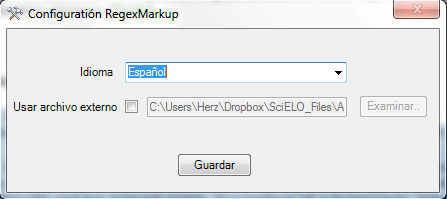
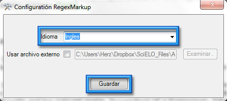
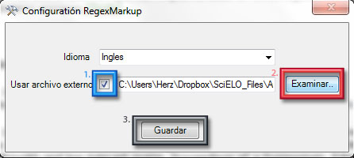

Configure
=========

You can configure the app when click button in the group.
	.. image:: ./images/config-button.jpg

The next window appear

and you can:

* `Change interface language of app`_
 
* `Use your rules definition file`_

Change interface language of app
--------------------------------

To change the interface language only choose and click the save button.

Use your rules definition file
------------------------------
You can use a personal rules definition file to test, develop or group only rules needed...

1. Check, "Using external file"
2. Choose you file pressing "Browse" button
3. Click "Save" button

