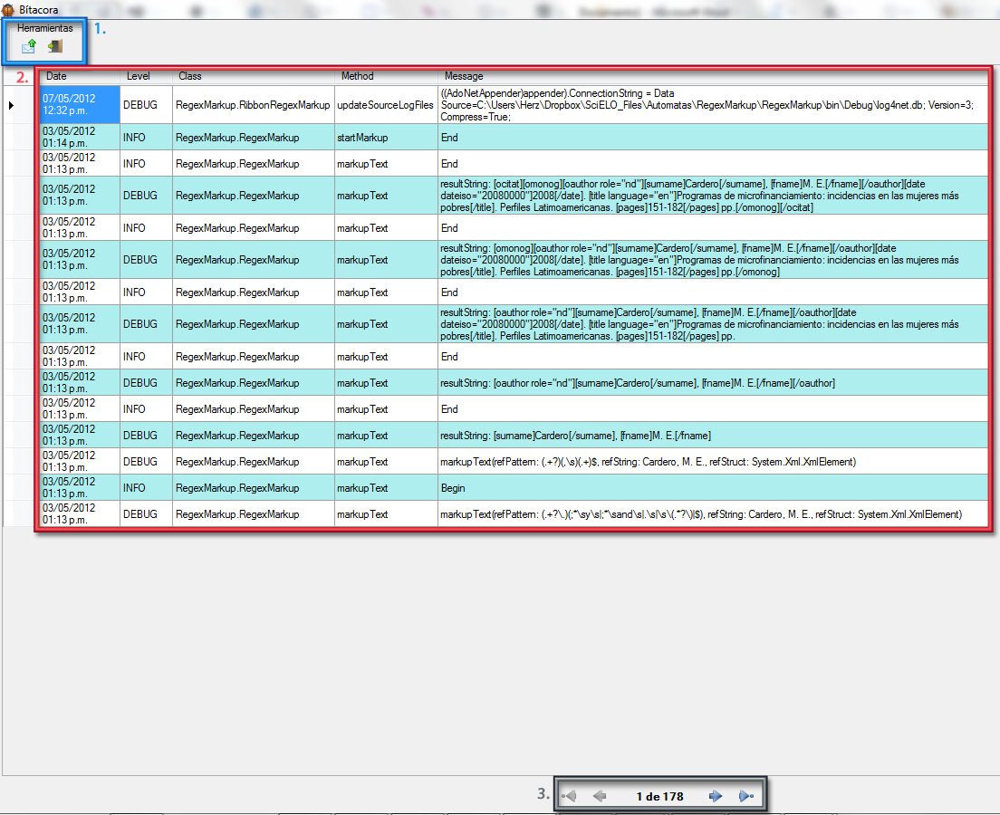

Use log book
============

The purpose of log book is identifying bugs, debugging developing rules and send mail with log book to a developer.

* To access log book, click on corresponding button.

	.. image:: ./images/logbook_button.jpg

	After click button you can see the `Log book window`_

Log book window
---------------

1. Toolbar
	* *Send log book*, on click this you send a email to the developer, that contains the log book
		.. image:: ./images/logboog-send-email.jpg

	* *Exit*, click to exit from log book.
		.. image:: ./images/logboog-exit.jpg

2. Log records
	This is a records of debug and errors
3. Navigation bar
	You can navigate in records using the arrows.
